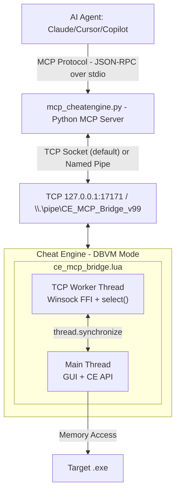

**[English](README.md) | [中文](README_CN.md)**

[Demo](https://github.com/user-attachments/assets/a184a006-f569-4b55-858a-ed80a7139035)

# Cheat Engine MCP Bridge (TCP Enhanced Fork)

**Let multibillion $ AI datacenters analyze the program memory for you.**

Create mods, trainers, security audits, game bots, accelerate RE, or do anything else with any program and game in a fraction of a time.

[](#) [](https://python.org) [](#)

> [!NOTE]
> Thanks everyone for the stars, much appreciated! <3
> 
> Specially a big thank you to all the contributors!!
> 
> [@libangli218](https://github.com/libangli218), [@lauralex](https://github.com/lauralex), [@iamtyroon](https://github.com/iamtyroon)

---

## The Problem

You're staring at gigabytes of memory. Millions of addresses. Thousands of functions. Finding *that one pointer*, *that one structure* takes **days or weeks** of manual work.

**What if you could just ask?**

> *"Find the packet decryptor hook."*  
> *"Find the OPcode of character coordinates."*  
> *"Find the OPcode of health values."*  
> *"Find the unique AOB pattern to make my trainer reliable after game updates."*

**That's exactly what this does.**

_- Stop clicking through hex dumps and start having conversations with the memory._

---

## What You Get:

| Before (Manual) | After (AI Agent + MCP) |
|-----------------|---------------------|
| Day 1: Find packet address | Minute 1: "Find RX packet decryption hook" |
| Day 2: Trace what writes to it | Minute 3: "Generate unique AOB signature to make it update persistent" |
| Day 3: Find RX hook | Minute 6: "Find movement OPcodes" |
| Day 4: Document structure | Minute 10: "Create python interpreter of hex to plain text" |
| Day 5: Game updates, start over | **Done.** |

**Your AI can now:**
- Read any memory instantly (integers, floats, strings, pointers)
- Follow pointer chains: `[[base+0x10]+0x20]+0x8` → resolved in ms
- Auto-analyze structures with field types and values
- Identify C++ objects via RTTI: *"This is a CPlayer object"*
- Disassemble and analyze functions
- Debug invisibly with hardware breakpoints + Ring -1 hypervisor
- Connect to **local or remote** Cheat Engine instances over TCP
- And much more!

---

## How It Works



### Transport Modes

| Mode | Protocol | Use Case |
|------|----------|----------|
| **TCP** (default) | TCP/IP socket on port 17171 | Local and remote, stable reconnection |
| **Pipe** (legacy) | Windows Named Pipe | Local only, requires `pywin32` |

TCP mode uses a Winsock FFI layer built directly into the CE Lua script — no external dependencies needed in Cheat Engine.

---

## Installation

```bash
pip install -r MCP_Server/requirements.txt
```
Or manually:
```bash
pip install mcp
```

> [!NOTE]
> `pywin32` is only required for legacy Named Pipe mode. TCP mode (default) has no additional dependencies beyond `mcp`.

---

## Quick Start

### 1. Load Bridge in Cheat Engine
1. Enable DBVM in Cheat Engine if you plan to use DBVM tools.
2. Open Cheat Engine's Lua Engine or script executor.
   - Preferred: `File` -> `Execute Script` -> open `MCP_Server/ce_mcp_bridge.lua` -> `Execute`.
   - If your Cheat Engine build does not show `File` -> `Execute Script`, use `Table` -> `Show Cheat Table Lua Script`, paste the `dofile(...)` line below, and execute it:

```lua
dofile([[C:\path\to\cheatengine-mcp-bridge\MCP_Server\ce_mcp_bridge.lua]])
```

Look for:
```
[MCP v14.1.0] Starting MCP Bridge v14.1.0 [tcp]
[MCP v14.1.0] TCP Server listening on 0.0.0.0:17171
```

### 2. Configure MCP Client

**Cursor IDE** — add to `.cursor/mcp.json`:
```json
{
  "mcpServers": {
    "cheatengine": {
      "command": "python",
      "args": ["C:/path/to/MCP_Server/mcp_cheatengine.py"],
      "env": {
        "CE_TRANSPORT": "tcp",
        "CE_HOST": "127.0.0.1",
        "CE_PORT": "17171"
      }
    }
  }
}
```

**Remote Cheat Engine** — change `CE_HOST` to the remote machine's IP:
```json
{
  "mcpServers": {
    "cheatengine": {
      "command": "python",
      "args": ["C:/path/to/MCP_Server/mcp_cheatengine.py"],
      "env": {
        "CE_TRANSPORT": "tcp",
        "CE_HOST": "192.168.1.100",
        "CE_PORT": "17171"
      }
    }
  }
}
```

**Codex** — add a TOML server block to `~/.codex/config.toml`:

```toml
[mcp_servers.cheatengine]
command = "python"
args = ['C:\path\to\cheatengine-mcp-bridge\MCP_Server\mcp_cheatengine.py']
```

Use single quotes for the Windows path so TOML treats backslashes literally.

Restart the IDE to load the MCP server config.

### 3. Verify Connection
Use the `ping` tool to verify connectivity:
```json
{"success": true, "version": "14.1.0", "message": "CE MCP Bridge v14.1.0 alive"}
```

### 4. Start Asking Questions
```
"What process is attached?"
"Read 16 bytes at the base address"
"Disassemble the entry point"
```

---

## ~180 MCP Tools Available

### Memory
| Tool | Description |
|------|-------------|
| `read_memory`, `read_integer`, `read_string` | Read any data type |
| `read_pointer_chain` | Follow `[[base+0x10]+0x20]` paths |
| `scan_all`, `aob_scan` | Find values and byte patterns |

### Analysis
| Tool | Description |
|------|-------------|
| `disassemble`, `analyze_function` | Code analysis |
| `dissect_structure` | Auto-detect fields and types |
| `get_rtti_classname` | Identify C++ object types |
| `find_references`, `find_call_references` | Cross-references |

### Debugging
| Tool | Description |
|------|-------------|
| `set_breakpoint`, `set_data_breakpoint` | Hardware breakpoints |
| `start_dbvm_watch` | Ring -1 invisible tracing |

### Process Lifecycle
| Tool | Description |
|------|-------------|
| `open_process`, `get_process_list` | Attach to or enumerate running processes |
| `create_process` | Launch a new process under CE's control |
| `pause_process`, `unpause_process` | Suspend / resume target execution |

### Memory Allocation
| Tool | Description |
|------|-------------|
| `allocate_memory`, `free_memory` | Reserve and release memory in the target |
| `set_memory_protection`, `full_access` | Adjust page protection flags |

### Code Injection
| Tool | Description |
|------|-------------|
| `inject_dll` | Load a DLL into the target process |
| `execute_code`, `execute_method` | Run shellcode or CE Lua methods remotely |

### Symbol Management
| Tool | Description |
|------|-------------|
| `register_symbol`, `get_symbol_info` | Create and query named symbols |
| `enable_windows_symbols` | Enable PDB symbol resolution |

### Assembly / Compilation
| Tool | Description |
|------|-------------|
| `assemble_instruction` | Assemble a single x86/x64 instruction to bytes |
| `compile_c_code` | Compile C source into injected shellcode |
| `generate_api_hook_script` | Generate a CE auto-assembler API hook template |

### Window / GUI Automation
| Tool | Description |
|------|-------------|
| `find_window` | Locate a window by title or class |
| `send_window_message` | Post `WM_*` messages to a target window |

### Input Automation
| Tool | Description |
|------|-------------|
| `get_pixel` | Sample a pixel color at screen coordinates |
| `is_key_pressed`, `do_key_press` | Query and simulate keyboard input |

### Cheat Table
| Tool | Description |
|------|-------------|
| `load_table`, `save_table` | Load / save `.CT` cheat table files |
| `get_address_list` | Enumerate entries in the active cheat table |

### Kernel Mode (DBK / DBVM)
| Tool | Description |
|------|-------------|
| `dbk_get_cr3` | Read the CR3 register for the target process |
| `read_process_memory_cr3` | Read physical memory via CR3 bypass |

And many more at `AI_Context/MCP_Bridge_Command_Reference.md`

---

## Environment Variables

| Variable | Default | Purpose |
|----------|---------|---------|
| `CE_TRANSPORT` | `tcp` | Transport mode: `tcp` (recommended) or `pipe` (legacy). |
| `CE_HOST` | `127.0.0.1` | TCP host address of the Cheat Engine instance. Set to a remote IP for remote debugging. |
| `CE_PORT` | `17171` | TCP base port. The CE bridge auto-increments if the port is in use. |
| `CE_PORT_RANGE` | `10` | Number of ports to scan starting from `CE_PORT`. The Python client tries each port and verifies the CE bridge via `ping`. |
| `CE_MCP_TIMEOUT` | `90` | Timeout (seconds) for each MCP tool call. Set to `0` to disable. |
| `CE_MCP_ALLOW_SHELL` | *unset* | Set to `1` to enable `run_command` / `shell_execute` tools. **Arbitrary code execution risk** — leave unset by default. |

---

## TCP Architecture Details

### CE Lua Server (ce_mcp_bridge.lua)

The Lua script implements a full TCP server inside Cheat Engine using a **Winsock FFI layer**:

1. **Kernel32 Bootstrap** — resolves `VirtualAlloc`, `VirtualFree`, `LoadLibraryA`, `GetProcAddress` using `getAddressSafe(name, true)` (CE's own process).
2. **Winsock Init** — loads `ws2_32.dll` into CE's process and resolves 14 socket functions.
3. **TCP Server** — binds to `0.0.0.0:17171` (auto-increments to 17181 if ports are busy), listens with backlog 1.
4. **Accept Loop** — uses `select()` with 1-second timeout to efficiently wait for connections.
5. **Recv Loop** — uses `select()` with 5-second timeout to detect data or client disconnect.
6. **Command Execution** — `thread.synchronize()` dispatches commands to CE's main thread for API safety.
7. **Framing Protocol** — 4-byte little-endian length prefix + UTF-8 JSON-RPC payload.

### Python Client (mcp_cheatengine.py)

- **Port Scanning** — tries ports `CE_PORT` through `CE_PORT + CE_PORT_RANGE - 1`, verifying each with a `ping` command to ensure it's a CE bridge (not another service).
- **Auto-Reconnection** — if the connection drops, the next command automatically reconnects.
- **Thread Safety** — `threading.Lock()` serializes concurrent tool calls from the MCP framework.
- **Timeout Protection** — configurable per-call timeout with automatic socket cleanup.

### Port Auto-Increment

If the default port (17171) is occupied:

| Scenario | CE Server Port | Python Client Behavior |
|----------|---------------|----------------------|
| Single CE instance | 17171 | Connects directly |
| Port 17171 busy (e.g., another CE) | 17172 | Scans 17171-17180, finds CE on 17172 |
| Two CE instances | 17171, 17172 | Connects to the first CE bridge found |

---

## Remote Cheat Engine Setup

To control a Cheat Engine instance on another machine:

1. **Network** — ensure TCP port 17171 is reachable (firewall, VPN, etc.).
2. **CE Side** — execute `ce_mcp_bridge.lua` on the remote machine. The server binds to `0.0.0.0` (all interfaces) by default.
3. **Cursor Side** — set `CE_HOST` to the remote machine's IP address:

```json
{
  "env": {
    "CE_HOST": "10.0.0.50",
    "CE_PORT": "17171"
  }
}
```

4. **Verify** — use the `ping` tool. A successful response confirms the bridge is operational.

> [!CAUTION]
> The TCP bridge has no authentication. Only use on trusted networks (VPN, LAN). Do not expose port 17171 to the public internet.

---

## Critical Configuration

### BSOD Prevention
> [!CAUTION]
> **You MUST disable:** Cheat Engine → Settings → Extra → **"Query memory region routines"**
> 
> Enabled: Causes `CLOCK_WATCHDOG_TIMEOUT` BSODs due to conflicts with DBVM/Anti-Cheat when scanning protected pages.

### Known Tool Limitations

Some CE API functions can cause Access Violations (CE crash) when called with invalid inputs. These are CE internal issues, not bridge bugs:

| Tool | Risk | Mitigation |
|------|------|------------|
| `get_rtti_classname` | Crashes if address doesn't point to a C++ vtable | Only use on known C++ object addresses |
| `aob_scan` (very large range) | May timeout for full-process scans | Use `aob_scan_module` to limit scope |
| Heavy operations on explorer.exe | Large response data may cause timeout | Prefer targeted scans over full enumeration |

---

## Troubleshooting

### Cheat Engine says "too many local variables"

Load the bridge from disk with `dofile(...)` instead of pasting the full script into a cheat table script. The bridge also declares command handlers as global functions intentionally; this avoids Cheat Engine's Lua chunk limit of 200 local variables when the complete bridge is compiled at once.

### MCP client cannot connect (TCP mode)

Check these in order:

1. CE Lua output shows `TCP Server listening on 0.0.0.0:17171`.
2. Run `netstat -an | findstr 17171` to confirm the port is listening.
3. If using remote CE, verify the network route (ping, firewall, VPN).
4. Check `CE_HOST` and `CE_PORT` match in your MCP config.
5. Restart the IDE after modifying `mcp.json` / MCP config.
6. Use the `ping` tool — `process_id: 0` is normal until CE is attached to a target.

### MCP client cannot connect (Pipe mode)

1. CE shows `MCP Server Listening on: CE_MCP_Bridge_v99`.
2. `pip install pywin32` is installed.
3. Set `CE_TRANSPORT=pipe` in the MCP config environment.

### Connection drops during heavy operations

The Python client timeout defaults to 90 seconds. For extremely heavy operations (full-process AOB scan, thousands of memory regions), increase `CE_MCP_TIMEOUT`:

```json
{
  "env": {
    "CE_MCP_TIMEOUT": "180"
  }
}
```

### CE UI freezes briefly during commands

`thread.synchronize()` runs each command on CE's main thread. Short commands (<100ms) are imperceptible. Heavy commands (module scans, large memory reads) may briefly freeze the UI. This is by design for API thread safety.

---

## Example Workflows

**Finding a value:**
```
You: "Scan for gold: 15000"  →  AI finds 47 results
You: "Gold changed to 15100"  →  AI filters to 3 addresses
You: "What writes to the first one?"  →  AI sets hardware BP
You: "Disassemble that function"  →  Full AddGold logic revealed
```

**Understanding a structure:**
```
You: "What's at [[game.exe+0x1234]+0x10]?"
AI: "RTTI: CPlayerInventory"
AI: "0x00=vtable, 0x08=itemCount(int), 0x10=itemArray(ptr)..."
```

**Remote debugging:**
```
You: "Connect to CE on 192.168.1.100 and list modules"
AI: [connects via TCP] "Found 389 modules in Explorer.EXE"
You: "Disassemble ntdll.NtQueryInformationProcess"
AI: "mov r10, rcx / mov eax, 0x19 / ..."
```

---

## Project Structure

```
CLAUDE.md                               # Claude Code agent guidance (this repo)
README.md                               # User-facing documentation (English)
README_CN.md                            # User-facing documentation (Chinese)

MCP_Server/
├── mcp_cheatengine.py                  # Python MCP Server (FastMCP, TCP/Pipe client)
├── ce_mcp_bridge.lua                   # Cheat Engine Lua Bridge (TCP/Pipe server)
├── requirements.txt                    # Python dependencies
└── test_mcp.py                         # Test Suite

AI_Context/
├── BATCH_WORKER_BRIEFING.md            # Parallel-worker task specifications
├── MCP_Bridge_Command_Reference.md     # MCP Commands reference
├── CE_LUA_Documentation.md             # Full CheatEngine 7.6 official documentation
└── AI_Guide_MCP_Server_Implementation.md  # Full technical documentation for AI agent
```

---

## Testing

Running the test:
```bash
python MCP_Server/test_mcp.py
```

Expected output:
```
✅ Memory Reading: 6/6 tests passed
✅ Process Info: 4/4 tests passed  
✅ Code Analysis: 8/8 tests passed
✅ Breakpoints: 4/4 tests passed
✅ DBVM Functions: 3/3 tests passed
✅ Utility Commands: 11/11 tests passed
⏭️ Skipped: 1 test (generate_signature)
────────────────────────────────────
Total: 36/37 PASSED (100% success)
```

---

## Changelog

### v14.1.0
- **TCP Transport** (default) — Winsock FFI TCP server in CE Lua, no external dependencies
- **Remote Support** — connect to CE on any machine via `CE_HOST`
- **Port Auto-Increment** — CE server tries ports 17171-17181 if busy
- **Port Scanning Client** — Python client scans port range with `ping` verification
- **select()-driven I/O** — efficient accept and recv loops with 5-second disconnect detection
- **90-second default timeout** — increased from 30s for heavy operations
- **Named Pipe retained** — set `CE_TRANSPORT=pipe` for backward compatibility

### v12.0.0
- Initial public release with Named Pipe transport
- ~180 MCP tools covering memory, analysis, debugging, and more

---

## The Bottom Line

You no longer need to be an expert. Just ask the right questions.

⚠️ EDUCATIONAL DISCLAIMER

This code is for educational and research purposes only. It's created to show the capabilities of the Model Context Protocol (MCP) and LLM-based debugging. I do not condone the use of these tools for malicious hacking, cheating in multiplayer games, or violating Terms of Service. This is a demonstration of software engineering automation.

---

## Credits

This project is a TCP-enhanced fork of the original **Cheat Engine MCP Bridge**:

- **Original Project**: [miscusi-peek/cheatengine-mcp-bridge](https://github.com/miscusi-peek/cheatengine-mcp-bridge)
- **Original Author**: [@miscusi-peek](https://github.com/miscusi-peek)

The TCP transport layer, remote connectivity support, Winsock FFI implementation, and port auto-increment features were added in this fork.
