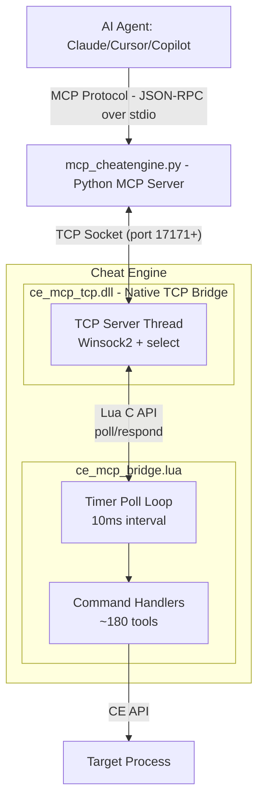

**[English](README.md) | [中文](README_CN.md)**

[Demo](https://github.com/user-attachments/assets/a184a006-f569-4b55-858a-ed80a7139035)

# Cheat Engine MCP Bridge (TCP Enhanced Fork)

**Let multibillion $ AI datacenters analyze the program memory for you.**

Create mods, trainers, security audits, game bots, accelerate RE, or do anything else with any program and game in a fraction of a time.

[](#) [](https://python.org) [-orange.svg)](#)

> [!NOTE]
> Thanks everyone for the stars, much appreciated! <3
> 
> Specially a big thank you to all the contributors!!
> 
> [@libangli218](https://github.com/libangli218), [@lauralex](https://github.com/lauralex), [@iamtyroon](https://github.com/iamtyroon)

---

## The Problem

You're staring at gigabytes of memory. Millions of addresses. Thousands of functions. Finding *that one pointer*, *that one structure* takes **days or weeks** of manual work.

**What if you could just ask?**

> *"Find the packet decryptor hook."*  
> *"Find the OPcode of character coordinates."*  
> *"Find the OPcode of health values."*  
> *"Find the unique AOB pattern to make my trainer reliable after game updates."*

**That's exactly what this does.**

_- Stop clicking through hex dumps and start having conversations with the memory._

---

## What You Get:

| Before (Manual) | After (AI Agent + MCP) |
|-----------------|---------------------|
| Day 1: Find packet address | Minute 1: "Find RX packet decryption hook" |
| Day 2: Trace what writes to it | Minute 3: "Generate unique AOB signature to make it update persistent" |
| Day 3: Find RX hook | Minute 6: "Find movement OPcodes" |
| Day 4: Document structure | Minute 10: "Create python interpreter of hex to plain text" |
| Day 5: Game updates, start over | **Done.** |

**Your AI can now:**
- Read any memory instantly (integers, floats, strings, pointers)
- Follow pointer chains: `[[base+0x10]+0x20]+0x8` → resolved in ms
- Auto-analyze structures with field types and values
- Identify C++ objects via RTTI: *"This is a CPlayer object"*
- Disassemble and analyze functions
- Debug invisibly with hardware breakpoints + Ring -1 hypervisor
- Connect to **local or remote** Cheat Engine instances over TCP
- And much more!

---

## How It Works



### Transport Modes

| Mode | Protocol | Use Case |
|------|----------|----------|
| **TCP** (default) | Native DLL TCP server on port 17171+ | Local and remote, stable reconnection |
| **Pipe** (legacy/deprecated) | Windows Named Pipe | Local only, requires `pywin32` |

TCP mode uses a native C DLL (`ce_mcp_tcp_x64.dll` / `ce_mcp_tcp_x86.dll`) loaded by the Lua bridge via `package.loadlib`. The DLL handles all Winsock TCP communication; Lua polls for commands on a 10ms timer and dispatches responses. No Winsock FFI or kernel32 bootstrap in Lua.

---

## Prerequisites

| Requirement | Version | Notes |
|-------------|---------|-------|
| **Python** | 3.10+ | Required for the MCP server |
| **Cheat Engine** | 7.5+ | 7.6 recommended; DBVM features require DBVM-enabled build |
| **Native TCP DLL** | v2.0.0 | `ce_mcp_tcp_x64.dll` or `ce_mcp_tcp_x86.dll` in CE executable directory |
| **pip package `mcp`** | latest | `pip install mcp` |
| **Git** | any | For cloning the repo |

> [!NOTE]
> `pywin32` is only required for legacy Named Pipe mode. TCP mode (default) has no additional Python dependencies beyond `mcp`.

---

## Installation

### Step 1: Clone the Repository

```bash
git clone https://github.com/HollyZoe/cheatengine-mcp-tcp-bridge.git
cd cheatengine-mcp-tcp-bridge
```

### Step 2: Install Python Dependencies

```bash
pip install -r MCP_Server/requirements.txt
```

Or install manually:

```bash
pip install mcp
```

> [!TIP]
> Using a virtual environment is recommended:
> ```bash
> python -m venv venv
> venv\Scripts\activate      # Windows
> source venv/bin/activate   # Linux/macOS
> pip install -r MCP_Server/requirements.txt
> ```

### Step 3: Place the Native TCP DLL in Cheat Engine's Directory

Copy the architecture-matching DLL from `MCP_Server/` into the **same folder as your Cheat Engine executable** (e.g. where `cheatengine-x86_64.exe` lives):

| CE build | DLL to copy |
|----------|-------------|
| 64-bit | `ce_mcp_tcp_x64.dll` |
| 32-bit | `ce_mcp_tcp_x86.dll` |

Example (64-bit CE installed at `C:\CE 7.5`):

```
C:\CE 7.5\cheatengine-x86_64.exe
C:\CE 7.5\ce_mcp_tcp_x64.dll    ← copy here
```

Pre-built binaries are also under `NativeBridge/bin/x64/` and `NativeBridge/bin/x86/` if you rebuild from source.

---

## Quick Start

### Step 1: Attach a Process in Cheat Engine

1. Open Cheat Engine.
2. Click the **computer icon** (top-left) to open the process list.
3. Select and attach to your target process (e.g., a game or application).
4. *(Optional)* If you plan to use DBVM tools (hardware breakpoints, Ring -1 tracing), enable DBVM: `DBVM` → `Enable DBVM`.

### Step 2: Load the MCP Bridge Script

There are two ways to load the bridge:

**Method A — Execute Script (Recommended)**
1. In Cheat Engine: `File` → `Execute Script`
2. Browse to and open `MCP_Server/ce_mcp_bridge.lua`
3. Click `Execute`

**Method B — Cheat Table Script (Fallback)**
1. In Cheat Engine: `Table` → `Show Cheat Table Lua Script`
2. Paste the following line (update the path to your actual location):

```lua
dofile([[C:\path\to\cheatengine-mcp-tcp-bridge\MCP_Server\ce_mcp_bridge.lua]])
```

3. Click `Execute`

**Expected output in Cheat Engine's Lua output window:**
```
[MCP] CE path: C:\path\to\CE 7.5
[MCP] CE x64 - loading ce_mcp_tcp_x64.dll
[MCP] DLL loaded OK from: C:\path\to\CE 7.5\ce_mcp_tcp_x64.dll
[MCP] Bridge started on port 17171 (native mode) - you can close this window now.
```

A **separate DLL debug console** also opens with diagnostic output:
```
[MCP-DLL] ce_mcp_tcp.dll loaded (v2.0.0)
[MCP-DLL] luaopen_ce_mcp_tcp called
[MCP-DLL] Resolving Lua API (17 functions)...
[MCP-DLL] Found module: lua53-64.dll
[MCP-DLL]   lua53-64.dll => 17/17 functions
[MCP-DLL] Native mode: 5 Lua functions registered
[MCP-DLL] mcp_tcp_start called
[MCP-DLL] TCP server thread started
[MCP-DLL] Listening on 0.0.0.0:17171 (mode: Lua API)
```

> [!TIP]
> If the DLL is missing, Lua output will indicate load failure — see [Troubleshooting](#troubleshooting). Place `ce_mcp_tcp_x64.dll` (or `_x86.dll`) next to the CE executable before running the script.

### Step 3: Configure Your AI Client

Choose your AI client below and add the MCP server configuration.

<details>
<summary><b>Cursor IDE</b></summary>

Add to your project's `.cursor/mcp.json` (or global `~/.cursor/mcp.json`):

```json
{
  "mcpServers": {
    "cheatengine": {
      "command": "python",
      "args": ["C:/path/to/cheatengine-mcp-tcp-bridge/MCP_Server/mcp_cheatengine.py"],
      "env": {
        "CE_TRANSPORT": "tcp",
        "CE_HOST": "127.0.0.1",
        "CE_PORT": "17171"
      }
    }
  }
}
```

After saving, **restart Cursor** (or reload the MCP servers in settings) to apply the configuration.

</details>

<details>
<summary><b>Claude Desktop</b></summary>

Add to `%APPDATA%\Claude\claude_desktop_config.json` (Windows) or `~/Library/Application Support/Claude/claude_desktop_config.json` (macOS):

```json
{
  "mcpServers": {
    "cheatengine": {
      "command": "python",
      "args": ["C:/path/to/cheatengine-mcp-tcp-bridge/MCP_Server/mcp_cheatengine.py"],
      "env": {
        "CE_TRANSPORT": "tcp",
        "CE_HOST": "127.0.0.1",
        "CE_PORT": "17171"
      }
    }
  }
}
```

Restart Claude Desktop after saving.

</details>

<details>
<summary><b>Codex CLI</b></summary>

Add a TOML server block to `~/.codex/config.toml`:

```toml
[mcp_servers.cheatengine]
command = "python"
args = ['C:\path\to\cheatengine-mcp-tcp-bridge\MCP_Server\mcp_cheatengine.py']
```

Use single quotes for the Windows path so TOML treats backslashes literally.

</details>

<details>
<summary><b>Remote Cheat Engine (different machine)</b></summary>

Change `CE_HOST` to the remote machine's IP address:

```json
{
  "env": {
    "CE_TRANSPORT": "tcp",
    "CE_HOST": "192.168.1.100",
    "CE_PORT": "17171"
  }
}
```

**Firewall setup on the CE machine:**

```powershell
# Windows Firewall — allow inbound TCP 17171
netsh advfirewall firewall add rule name="CE MCP Bridge" dir=in action=allow protocol=TCP localport=17171

# Linux (if applicable)
sudo ufw allow 17171/tcp
```

> [!CAUTION]
> The TCP bridge has **no authentication**. Only expose the port on trusted networks (VPN, LAN). Never open port 17171 to the public internet.

</details>

### Step 4: Verify the Connection

In your AI chat, ask the AI to verify the connection. It will use the `ping` tool automatically:

```
You: "Ping the Cheat Engine bridge"
```

Expected response:
```json
{"success": true, "version": "15.0.0", "message": "CE MCP Bridge v15.0.0 alive"}
```

> [!TIP]
> - `process_id: 0` in the ping response is **normal** — it means CE hasn't attached to a process yet, or the CE window is in idle state.
> - If the connection fails, see [Troubleshooting](#troubleshooting) below.

### Step 5: Start Using It

Now you can talk to the AI and it will interact with the target process through Cheat Engine:

```
You: "What process is attached?"
You: "Read 16 bytes at the base address of the main module"
You: "Disassemble the entry point of the main module"
You: "Scan for the integer value 99999"
You: "What's the RTTI class name at [[game.exe+0x1234]+0x10]?"
```

---

## ~180 MCP Tools Available

### Memory
| Tool | Description |
|------|-------------|
| `read_memory`, `read_integer`, `read_string` | Read any data type |
| `read_pointer_chain` | Follow `[[base+0x10]+0x20]` paths |
| `scan_all`, `aob_scan` | Find values and byte patterns |

### Analysis
| Tool | Description |
|------|-------------|
| `disassemble`, `analyze_function` | Code analysis |
| `dissect_structure` | Auto-detect fields and types |
| `get_rtti_classname` | Identify C++ object types |
| `find_references`, `find_call_references` | Cross-references |

### Debugging
| Tool | Description |
|------|-------------|
| `set_breakpoint`, `set_data_breakpoint` | Hardware breakpoints |
| `start_dbvm_watch` | Ring -1 invisible tracing |

### Process Lifecycle
| Tool | Description |
|------|-------------|
| `open_process`, `get_process_list` | Attach to or enumerate running processes |
| `create_process` | Launch a new process under CE's control |
| `pause_process`, `unpause_process` | Suspend / resume target execution |

### Memory Allocation
| Tool | Description |
|------|-------------|
| `allocate_memory`, `free_memory` | Reserve and release memory in the target |
| `set_memory_protection`, `full_access` | Adjust page protection flags |

### Code Injection
| Tool | Description |
|------|-------------|
| `inject_dll` | Load a DLL into the target process |
| `execute_code`, `execute_method` | Run shellcode or CE Lua methods remotely |

### Symbol Management
| Tool | Description |
|------|-------------|
| `register_symbol`, `get_symbol_info` | Create and query named symbols |
| `enable_windows_symbols` | Enable PDB symbol resolution |

### Assembly / Compilation
| Tool | Description |
|------|-------------|
| `assemble_instruction` | Assemble a single x86/x64 instruction to bytes |
| `compile_c_code` | Compile C source into injected shellcode |
| `generate_api_hook_script` | Generate a CE auto-assembler API hook template |

### Window / GUI Automation
| Tool | Description |
|------|-------------|
| `find_window` | Locate a window by title or class |
| `send_window_message` | Post `WM_*` messages to a target window |

### Input Automation
| Tool | Description |
|------|-------------|
| `get_pixel` | Sample a pixel color at screen coordinates |
| `is_key_pressed`, `do_key_press` | Query and simulate keyboard input |

### Cheat Table
| Tool | Description |
|------|-------------|
| `load_table`, `save_table` | Load / save `.CT` cheat table files |
| `get_address_list` | Enumerate entries in the active cheat table |

### Kernel Mode (DBK / DBVM)
| Tool | Description |
|------|-------------|
| `dbk_get_cr3` | Read the CR3 register for the target process |
| `read_process_memory_cr3` | Read physical memory via CR3 bypass |

And many more at `AI_Context/MCP_Bridge_Command_Reference.md`

---

## Environment Variables

| Variable | Default | Purpose |
|----------|---------|---------|
| `CE_TRANSPORT` | `tcp` | Transport mode: `tcp` (recommended) or `pipe` (legacy/deprecated). |
| `CE_HOST` | `127.0.0.1` | TCP host address of the Cheat Engine instance. Set to a remote IP for remote debugging. |
| `CE_PORT` | `17171` | TCP base port. The DLL auto-increments if the port is in use. |
| `CE_PORT_RANGE` | `10` | Number of ports to scan starting from `CE_PORT`. The Python client tries each port and verifies the CE bridge via `ping`. |
| `CE_MCP_TIMEOUT` | `90` | Timeout (seconds) for each MCP tool call. Set to `0` to disable. |
| `CE_MCP_ALLOW_SHELL` | *unset* | Set to `1` to enable `run_command` / `shell_execute` tools. **Arbitrary code execution risk** — leave unset by default. |

---

## TCP Architecture Details

### Native TCP Bridge DLL (`ce_mcp_tcp_x64.dll` / `ce_mcp_tcp_x86.dll`)

A compiled C DLL (v2.0.0) handles all TCP communication. It replaces the previous Winsock FFI implementation in Lua.

| Aspect | Detail |
|--------|--------|
| **Loading** | Lua loads the DLL via `package.loadlib` from the CE executable directory |
| **Lua API** | DLL dynamically resolves 17 Lua C API functions from `lua53-64.dll` (or similar) in CE's directory |
| **Registered functions** | `mcp_tcp_start`, `mcp_tcp_stop`, `mcp_tcp_poll`, `mcp_tcp_respond`, `mcp_tcp_status` |
| **Build** | Compiled with `/MT` (static CRT) — no Visual C++ runtime redistributable required |
| **Logging** | Opens a separate debug console window (`[MCP-DLL]` prefix) |
| **Fallback** | File IPC mode when Lua API cannot be resolved (see DLL debug console) |

**DLL TCP server flow:**

1. **Bind & listen** — binds to `0.0.0.0:17171` (auto-increments if ports are busy), TCP server thread uses Winsock2 + `select()`.
2. **Accept & recv** — accepts one client at a time, receives framed JSON-RPC requests.
3. **Queue to Lua** — incoming commands are queued; Lua's 10ms timer calls `mcp_tcp_poll` to dequeue.
4. **Execute on main thread** — Lua command handlers run CE API calls (same ~180 tools as before).
5. **Respond** — Lua calls `mcp_tcp_respond` with JSON results; DLL sends length-prefixed UTF-8 payload.
6. **Framing** — 4-byte little-endian length prefix + UTF-8 JSON-RPC payload (unchanged from v14).

### CE Lua Bridge (`ce_mcp_bridge.lua`)

The Lua script is now a thin loader and command dispatcher (~1000 lines of dead FFI/Winsock/Pipe code removed):

1. Resolves CE install path and loads the correct architecture DLL.
2. Calls `mcp_tcp_start(port)` to start the native TCP server.
3. Creates a **10ms timer** that polls `mcp_tcp_poll`, dispatches commands to handlers, and calls `mcp_tcp_respond`.
4. No Winsock FFI, no kernel32 bootstrap, no `getAddressSafe` dependency.

### Python Client (`mcp_cheatengine.py`)

- **Port Scanning** — tries ports `CE_PORT` through `CE_PORT + CE_PORT_RANGE - 1`, verifying each with a `ping` command to ensure it's a CE bridge (not another service).
- **Auto-Reconnection** — if the connection drops, the next command automatically reconnects.
- **Thread Safety** — `threading.Lock()` serializes concurrent tool calls from the MCP framework.
- **Timeout Protection** — configurable per-call timeout with automatic socket cleanup.

### Port Auto-Increment

If the default port (17171) is occupied, the **DLL** auto-increments (same behavior as v14, now in native code):

| Scenario | CE Server Port | Python Client Behavior |
|----------|---------------|----------------------|
| Single CE instance | 17171 | Connects directly |
| Port 17171 busy (e.g., another CE) | 17172 | Scans 17171-17180, finds CE on 17172 |
| Two CE instances | 17171, 17172 | Connects to the first CE bridge found |

---

## Remote Cheat Engine Setup

To control a Cheat Engine instance on another machine:

1. **Network** — ensure TCP port 17171 is reachable (firewall, VPN, etc.).
2. **CE Side** — copy the DLL to the remote CE directory, then execute `ce_mcp_bridge.lua`. The server binds to `0.0.0.0` (all interfaces) by default.
3. **Cursor Side** — set `CE_HOST` to the remote machine's IP address:

```json
{
  "env": {
    "CE_HOST": "10.0.0.50",
    "CE_PORT": "17171"
  }
}
```

4. **Verify** — use the `ping` tool. A successful response confirms the bridge is operational.

> [!CAUTION]
> The TCP bridge has no authentication. Only use on trusted networks (VPN, LAN). Do not expose port 17171 to the public internet.

---

## Critical Configuration

### BSOD Prevention
> [!CAUTION]
> **You MUST disable:** Cheat Engine → Settings → Extra → **"Query memory region routines"**
> 
> Enabled: Causes `CLOCK_WATCHDOG_TIMEOUT` BSODs due to conflicts with DBVM/Anti-Cheat when scanning protected pages.

### Known Tool Limitations

Some CE API functions can cause Access Violations (CE crash) when called with invalid inputs. These are CE internal issues, not bridge bugs:

| Tool | Risk | Mitigation |
|------|------|------------|
| `get_rtti_classname` | Crashes if address doesn't point to a C++ vtable | Only use on known C++ object addresses |
| `aob_scan` (very large range) | May timeout for full-process scans | Use `aob_scan_module` to limit scope |
| Heavy operations on explorer.exe | Large response data may cause timeout | Prefer targeted scans over full enumeration |

---

## Troubleshooting

### Cheat Engine says "too many local variables"

Load the bridge from disk with `dofile(...)` instead of pasting the full script into a cheat table script. The bridge also declares command handlers as global functions intentionally; this avoids Cheat Engine's Lua chunk limit of 200 local variables when the complete bridge is compiled at once.

### DLL not found or failed to load

1. Copy `ce_mcp_tcp_x64.dll` (64-bit CE) or `ce_mcp_tcp_x86.dll` (32-bit CE) into the **same directory as** `cheatengine-x86_64.exe` (or your CE executable).
2. Pre-built copies ship in `MCP_Server/` in this repo.
3. CE Lua output should show `DLL loaded OK from: ...` — if not, check the path and architecture match (x64 CE needs `_x64.dll`).

### Lua API resolution failed

1. Open the **DLL debug console** window (opens automatically when the bridge starts).
2. Look for lines like `Found module: lua53-64.dll` and `17/17 functions`.
3. If resolution fails, the DLL may fall back to file IPC mode — details are logged in that console.
4. Ensure you are using CE 7.5+ with a standard Lua 5.3 build.

### MCP client cannot connect (TCP mode)

Check these in order:

1. CE Lua output shows `Bridge started on port 17171 (native mode)`.
2. DLL debug console shows `Listening on 0.0.0.0:17171`.
3. Run `netstat -an | findstr 17171` to confirm the port is listening.
4. If using remote CE, verify the network route (ping, firewall, VPN).
5. Check `CE_HOST` and `CE_PORT` match in your MCP config.
6. Restart the IDE after modifying `mcp.json` / MCP config.
7. Use the `ping` tool — `process_id: 0` is normal until CE is attached to a target.
8. **Port in use** — the DLL auto-increments ports; check the DLL console for the actual listening port and align `CE_PORT` / port scan range if needed.

### MCP client cannot connect (Pipe mode — legacy)

1. CE shows `MCP Server Listening on: CE_MCP_Bridge_v99`.
2. `pip install pywin32` is installed.
3. Set `CE_TRANSPORT=pipe` in the MCP config environment.

> [!NOTE]
> Pipe mode is legacy/deprecated. TCP with the native DLL is recommended for all new setups.

### Connection drops during heavy operations

The Python client timeout defaults to 90 seconds. For extremely heavy operations (full-process AOB scan, thousands of memory regions), increase `CE_MCP_TIMEOUT`:

```json
{
  "env": {
    "CE_MCP_TIMEOUT": "180"
  }
}
```

### CE UI freezes briefly during commands

Command handlers run on CE's main thread via the Lua timer poll loop. Short commands (<100ms) are imperceptible. Heavy commands (module scans, large memory reads) may briefly freeze the UI. This is by design for API thread safety.

---

## Example Workflows

**Finding a value:**
```
You: "Scan for gold: 15000"  →  AI finds 47 results
You: "Gold changed to 15100"  →  AI filters to 3 addresses
You: "What writes to the first one?"  →  AI sets hardware BP
You: "Disassemble that function"  →  Full AddGold logic revealed
```

**Understanding a structure:**
```
You: "What's at [[game.exe+0x1234]+0x10]?"
AI: "RTTI: CPlayerInventory"
AI: "0x00=vtable, 0x08=itemCount(int), 0x10=itemArray(ptr)..."
```

**Remote debugging:**
```
You: "Connect to CE on 192.168.1.100 and list modules"
AI: [connects via TCP] "Found 389 modules in Explorer.EXE"
You: "Disassemble ntdll.NtQueryInformationProcess"
AI: "mov r10, rcx / mov eax, 0x19 / ..."
```

---

## Project Structure

```
CLAUDE.md                               # Claude Code agent guidance (this repo)
README.md                               # User-facing documentation (English)
README_CN.md                            # User-facing documentation (Chinese)

NativeBridge/
├── ce_mcp_tcp.c                        # Native TCP bridge DLL source
├── build.bat                           # Build script (requires VS Build Tools)
├── bin/x64/ce_mcp_tcp_x64.dll         # Pre-built 64-bit DLL
└── bin/x86/ce_mcp_tcp_x86.dll         # Pre-built 32-bit DLL

MCP_Server/
├── mcp_cheatengine.py                  # Python MCP Server
├── ce_mcp_bridge.lua                   # CE Lua Bridge (DLL loader + command handler)
├── ce_mcp_tcp_x64.dll                  # Pre-built 64-bit DLL (copy for convenience)
├── ce_mcp_tcp_x86.dll                  # Pre-built 32-bit DLL (copy for convenience)
├── requirements.txt                    # Python dependencies
└── test_mcp.py                         # Test Suite

AI_Context/
├── BATCH_WORKER_BRIEFING.md            # Parallel-worker task specifications
├── MCP_Bridge_Command_Reference.md     # MCP Commands reference
├── CE_LUA_Documentation.md             # Full CheatEngine 7.6 official documentation
└── AI_Guide_MCP_Server_Implementation.md  # Full technical documentation for AI agent
```

---

## Testing

Running the test:
```bash
python MCP_Server/test_mcp.py
```

Expected output:
```
✅ Memory Reading: 6/6 tests passed
✅ Process Info: 4/4 tests passed  
✅ Code Analysis: 8/8 tests passed
✅ Breakpoints: 4/4 tests passed
✅ DBVM Functions: 3/3 tests passed
✅ Utility Commands: 11/11 tests passed
⏭️ Skipped: 1 test (generate_signature)
────────────────────────────────────
Total: 36/37 PASSED (100% success)
```

---

## Changelog

### v15.0.0
- **Native DLL TCP Bridge** — Replaced Winsock FFI with a compiled C DLL for maximum compatibility
- **Cross-CE-version support** — DLL dynamically resolves Lua API from any CE build
- **Release MT build** — Static CRT linking, no VC runtime dependency
- **Architecture-specific DLLs** — `ce_mcp_tcp_x64.dll` and `ce_mcp_tcp_x86.dll`
- **Debug console** — DLL opens a separate console window for diagnostic logging
- **Robust path resolution** — DLL uses its own directory path to find Lua libraries
- **Eliminated kernel32 FFI issues** — No more `getAddressSafe` or PEB-walk failures
- **Cleaned up Lua script** — Removed ~1000 lines of dead FFI/Winsock/Pipe code

### v14.1.0
- **TCP Transport** (default) — Winsock FFI TCP server in CE Lua, no external dependencies
- **Remote Support** — connect to CE on any machine via `CE_HOST`
- **Port Auto-Increment** — CE server tries ports 17171-17181 if busy
- **Port Scanning Client** — Python client scans port range with `ping` verification
- **select()-driven I/O** — efficient accept and recv loops with 5-second disconnect detection
- **90-second default timeout** — increased from 30s for heavy operations
- **Named Pipe retained** — set `CE_TRANSPORT=pipe` for backward compatibility

### v12.0.0
- Initial public release with Named Pipe transport
- ~180 MCP tools covering memory, analysis, debugging, and more

---

## The Bottom Line

You no longer need to be an expert. Just ask the right questions.

⚠️ EDUCATIONAL DISCLAIMER

This code is for educational and research purposes only. It's created to show the capabilities of the Model Context Protocol (MCP) and LLM-based debugging. I do not condone the use of these tools for malicious hacking, cheating in multiplayer games, or violating Terms of Service. This is a demonstration of software engineering automation.

---

## Credits

This project is a TCP-enhanced fork of the original **Cheat Engine MCP Bridge**:

- **Original Project**: [miscusi-peek/cheatengine-mcp-bridge](https://github.com/miscusi-peek/cheatengine-mcp-bridge)
- **Original Author**: [@miscusi-peek](https://github.com/miscusi-peek)

The TCP transport layer, remote connectivity support, native DLL TCP bridge (v2.0.0), and port auto-increment features were added in this fork.
