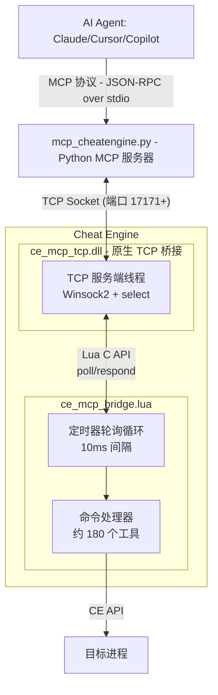

[Demo](https://github.com/user-attachments/assets/a184a006-f569-4b55-858a-ed80a7139035)

# Cheat Engine MCP Bridge（TCP 增强版）

**让价值数十亿美元的 AI 数据中心帮你分析程序内存。**

创建修改器、训练器、安全审计、游戏机器人、加速逆向工程——或者对任何程序和游戏做任何事情，效率提升数十倍。

[](#) [](https://python.org) [-orange.svg)](#)

---

## 痛点

你面对的是 GB 级别的内存数据、数百万个地址、数千个函数。找到**那个指针**、**那个结构体**可能要花费**数天甚至数周**的手动工作。

**如果你只需要问一句话呢？**

> *"找到数据包解密钩子。"*  
> *"找到角色坐标的操作码。"*  
> *"找到生命值的操作码。"*  
> *"找到唯一的 AOB 特征码，让修改器在游戏更新后依然可用。"*

**这就是本项目做的事情。**

_—— 不要再手动翻阅十六进制数据了，开始与内存对话吧。_

---

## 效果对比

| 传统手动方式 | AI Agent + MCP |
|-------------|---------------|
| 第 1 天：找数据包地址 | 第 1 分钟："找到 RX 数据包解密钩子" |
| 第 2 天：追踪写入源 | 第 3 分钟："生成唯一 AOB 特征码" |
| 第 3 天：找 RX 钩子 | 第 6 分钟："找到移动操作码" |
| 第 4 天：记录结构 | 第 10 分钟："创建十六进制转明文的解释器" |
| 第 5 天：游戏更新，从头再来 | **完成。** |

**AI 可以做到：**
- 即时读取任意内存（整数、浮点、字符串、指针）
- 跟踪指针链：`[[base+0x10]+0x20]+0x8` → 毫秒级解析
- 自动分析结构体字段类型和值
- 通过 RTTI 识别 C++ 对象：*"这是一个 CPlayer 对象"*
- 反汇编和分析函数
- 硬件断点 + Ring -1 虚拟机监控器实现隐形调试
- 通过 TCP 连接**本地或远程** Cheat Engine 实例
- 更多功能！

---

## 工作原理



### 传输模式

| 模式 | 协议 | 使用场景 |
|------|------|---------|
| **TCP**（默认） | 原生 DLL TCP 服务器，端口 17171+ | 本地和远程，稳定重连 |
| **Pipe**（旧版/已弃用） | Windows 命名管道 | 仅本地，需要 `pywin32` |

TCP 模式使用原生 C DLL（`ce_mcp_tcp_x64.dll` / `ce_mcp_tcp_x86.dll`），由 Lua 桥接脚本通过 `package.loadlib` 加载。DLL 负责所有 Winsock TCP 通信；Lua 以 10ms 定时器轮询命令并分发响应。Lua 中不再包含 Winsock FFI 或 kernel32 引导代码。

---

## 前置条件

| 条件 | 版本 | 说明 |
|------|------|------|
| **Python** | 3.10+ | MCP 服务器运行所需 |
| **Cheat Engine** | 7.5+ | 推荐 7.6；DBVM 功能需要 DBVM 版本的 CE |
| **原生 TCP DLL** | v2.0.0 | 将 `ce_mcp_tcp_x64.dll` 或 `ce_mcp_tcp_x86.dll` 放在 CE 可执行文件目录 |
| **pip 包 `mcp`** | 最新版 | `pip install mcp` |
| **Git** | 任意版本 | 用于克隆仓库 |

> [!NOTE]
> `pywin32` 仅在使用旧版命名管道（Pipe）模式时需要。TCP 模式（默认）除了 `mcp` 之外没有额外 Python 依赖。

---

## 安装

### 第一步：克隆仓库

```bash
git clone https://github.com/HollyZoe/cheatengine-mcp-tcp-bridge.git
cd cheatengine-mcp-tcp-bridge
```

### 第二步：安装 Python 依赖

```bash
pip install -r MCP_Server/requirements.txt
```

或手动安装：

```bash
pip install mcp
```

> [!TIP]
> 建议使用虚拟环境：
> ```bash
> python -m venv venv
> venv\Scripts\activate      # Windows
> source venv/bin/activate   # Linux/macOS
> pip install -r MCP_Server/requirements.txt
> ```

### 第三步：将原生 TCP DLL 放入 Cheat Engine 目录

从 `MCP_Server/` 复制与 CE 架构匹配的 DLL 到 **Cheat Engine 可执行文件所在目录**（例如 `cheatengine-x86_64.exe` 所在文件夹）：

| CE 版本 | 需复制的 DLL |
|---------|-------------|
| 64 位 | `ce_mcp_tcp_x64.dll` |
| 32 位 | `ce_mcp_tcp_x86.dll` |

示例（64 位 CE 安装在 `C:\CE 7.5`）：

```
C:\CE 7.5\cheatengine-x86_64.exe
C:\CE 7.5\ce_mcp_tcp_x64.dll    ← 复制到此
```

预编译二进制文件也可在 `NativeBridge/bin/x64/` 和 `NativeBridge/bin/x86/` 中找到（若从源码重新编译）。

---

## 快速开始

### 第一步：在 Cheat Engine 中附加目标进程

1. 打开 Cheat Engine。
2. 点击左上角的 **电脑图标** 打开进程列表。
3. 选择并附加到你的目标进程（如游戏或应用程序）。
4. *（可选）* 如需使用 DBVM 工具（硬件断点、Ring -1 追踪），请启用 DBVM：`DBVM` → `Enable DBVM`。

### 第二步：加载 MCP Bridge 脚本

有两种加载方式：

**方式 A — Execute Script（推荐）**
1. 在 Cheat Engine 中：`File` → `Execute Script`
2. 浏览并打开 `MCP_Server/ce_mcp_bridge.lua`
3. 点击 `Execute`

**方式 B — Cheat Table Script（备选）**
1. 在 Cheat Engine 中：`Table` → `Show Cheat Table Lua Script`
2. 粘贴以下代码（将路径替换为你的实际路径）：

```lua
dofile([[C:\path\to\cheatengine-mcp-tcp-bridge\MCP_Server\ce_mcp_bridge.lua]])
```

3. 点击 `Execute`

**Cheat Engine 的 Lua 输出窗口中应显示：**
```
[MCP] CE path: C:\path\to\CE 7.5
[MCP] CE x64 - loading ce_mcp_tcp_x64.dll
[MCP] DLL loaded OK from: C:\path\to\CE 7.5\ce_mcp_tcp_x64.dll
[MCP] Bridge started on port 17171 (native mode) - you can close this window now.
```

同时会打开 **独立的 DLL 调试控制台**，输出诊断信息：
```
[MCP-DLL] ce_mcp_tcp.dll loaded (v2.0.0)
[MCP-DLL] luaopen_ce_mcp_tcp called
[MCP-DLL] Resolving Lua API (17 functions)...
[MCP-DLL] Found module: lua53-64.dll
[MCP-DLL]   lua53-64.dll => 17/17 functions
[MCP-DLL] Native mode: 5 Lua functions registered
[MCP-DLL] mcp_tcp_start called
[MCP-DLL] TCP server thread started
[MCP-DLL] Listening on 0.0.0.0:17171 (mode: Lua API)
```

> [!TIP]
> 若 DLL 缺失，Lua 输出会提示加载失败 — 请参阅 [故障排除](#故障排除)。运行脚本前请将 `ce_mcp_tcp_x64.dll`（或 `_x86.dll`）放在 CE 可执行文件旁。

### 第三步：配置 AI 客户端

选择你使用的 AI 客户端，添加 MCP 服务器配置。

<details>
<summary><b>Cursor IDE</b></summary>

在项目目录的 `.cursor/mcp.json`（或全局 `~/.cursor/mcp.json`）中添加：

```json
{
  "mcpServers": {
    "cheatengine": {
      "command": "python",
      "args": ["C:/path/to/cheatengine-mcp-tcp-bridge/MCP_Server/mcp_cheatengine.py"],
      "env": {
        "CE_TRANSPORT": "tcp",
        "CE_HOST": "127.0.0.1",
        "CE_PORT": "17171"
      }
    }
  }
}
```

保存后**重启 Cursor**（或在设置中重新加载 MCP 服务器）以应用配置。

</details>

<details>
<summary><b>Claude Desktop</b></summary>

在 `%APPDATA%\Claude\claude_desktop_config.json`（Windows）或 `~/Library/Application Support/Claude/claude_desktop_config.json`（macOS）中添加：

```json
{
  "mcpServers": {
    "cheatengine": {
      "command": "python",
      "args": ["C:/path/to/cheatengine-mcp-tcp-bridge/MCP_Server/mcp_cheatengine.py"],
      "env": {
        "CE_TRANSPORT": "tcp",
        "CE_HOST": "127.0.0.1",
        "CE_PORT": "17171"
      }
    }
  }
}
```

保存后重启 Claude Desktop。

</details>

<details>
<summary><b>Codex CLI</b></summary>

在 `~/.codex/config.toml` 中添加：

```toml
[mcp_servers.cheatengine]
command = "python"
args = ['C:\path\to\cheatengine-mcp-tcp-bridge\MCP_Server\mcp_cheatengine.py']
```

Windows 路径使用单引号，TOML 会将反斜杠视为普通字符。

</details>

<details>
<summary><b>远程 Cheat Engine（不同机器）</b></summary>

将 `CE_HOST` 改为远程机器的 IP 地址：

```json
{
  "env": {
    "CE_TRANSPORT": "tcp",
    "CE_HOST": "192.168.1.100",
    "CE_PORT": "17171"
  }
}
```

**在 CE 所在机器上配置防火墙：**

```powershell
# Windows 防火墙 — 允许 TCP 17171 入站
netsh advfirewall firewall add rule name="CE MCP Bridge" dir=in action=allow protocol=TCP localport=17171

# Linux（如适用）
sudo ufw allow 17171/tcp
```

> [!CAUTION]
> TCP Bridge **没有身份验证**。仅在可信网络（VPN、局域网）中暴露该端口。绝不要将端口 17171 开放到公共互联网。

</details>

### 第四步：验证连接

在 AI 对话框中，让 AI 验证连接。它会自动调用 `ping` 工具：

```
你："Ping 一下 Cheat Engine"
```

预期响应：
```json
{"success": true, "version": "15.0.0", "message": "CE MCP Bridge v15.0.0 alive"}
```

> [!TIP]
> - ping 响应中的 `process_id: 0` 是**正常的** — 表示 CE 尚未附加目标进程，或 CE 窗口处于空闲状态。
> - 如果连接失败，请参考下方的 [故障排除](#故障排除) 章节。

### 第五步：开始使用

现在你可以与 AI 对话，它会通过 Cheat Engine 与目标进程交互：

```
你："当前附加了什么进程？"
你："读取主模块基地址处的 16 个字节"
你："反汇编主模块的入口点"
你："扫描整数值 99999"
你："[[game.exe+0x1234]+0x10] 处的 RTTI 类名是什么？"
```

---

## 约 180 个 MCP 工具

### 内存操作
| 工具 | 说明 |
|------|------|
| `read_memory`, `read_integer`, `read_string` | 读取任意数据类型 |
| `read_pointer_chain` | 跟踪指针链 `[[base+0x10]+0x20]` |
| `scan_all`, `aob_scan` | 搜索值和字节特征码 |

### 分析
| 工具 | 说明 |
|------|------|
| `disassemble`, `analyze_function` | 代码分析 |
| `dissect_structure` | 自动检测字段和类型 |
| `get_rtti_classname` | 识别 C++ 对象类型 |
| `find_references`, `find_call_references` | 交叉引用 |

### 调试
| 工具 | 说明 |
|------|------|
| `set_breakpoint`, `set_data_breakpoint` | 硬件断点 |
| `start_dbvm_watch` | Ring -1 隐形追踪 |

### 进程生命周期
| 工具 | 说明 |
|------|------|
| `open_process`, `get_process_list` | 附加或枚举进程 |
| `create_process` | 在 CE 控制下启动新进程 |
| `pause_process`, `unpause_process` | 暂停/恢复目标执行 |

### 内存分配
| 工具 | 说明 |
|------|------|
| `allocate_memory`, `free_memory` | 在目标进程中分配/释放内存 |
| `set_memory_protection`, `full_access` | 调整页面保护标志 |

### 代码注入
| 工具 | 说明 |
|------|------|
| `inject_dll` | 向目标进程注入 DLL |
| `execute_code`, `execute_method` | 远程执行 shellcode 或 CE Lua 方法 |

### 符号管理
| 工具 | 说明 |
|------|------|
| `register_symbol`, `get_symbol_info` | 创建和查询命名符号 |
| `enable_windows_symbols` | 启用 PDB 符号解析 |

### 汇编/编译
| 工具 | 说明 |
|------|------|
| `assemble_instruction` | 将单条 x86/x64 指令汇编为字节 |
| `compile_c_code` | 编译 C 源码为可注入的 shellcode |
| `generate_api_hook_script` | 生成 CE 自动汇编器 API 钩子模板 |

### 窗口/GUI 自动化
| 工具 | 说明 |
|------|------|
| `find_window` | 按标题或类名查找窗口 |
| `send_window_message` | 向目标窗口发送 `WM_*` 消息 |

### 输入自动化
| 工具 | 说明 |
|------|------|
| `get_pixel` | 采样屏幕坐标处的像素颜色 |
| `is_key_pressed`, `do_key_press` | 查询和模拟键盘输入 |

### 作弊表
| 工具 | 说明 |
|------|------|
| `load_table`, `save_table` | 加载/保存 `.CT` 作弊表文件 |
| `get_address_list` | 枚举活动作弊表中的条目 |

### 内核模式（DBK / DBVM）
| 工具 | 说明 |
|------|------|
| `dbk_get_cr3` | 读取目标进程的 CR3 寄存器 |
| `read_process_memory_cr3` | 通过 CR3 绕过读取物理内存 |

完整工具列表见 `AI_Context/MCP_Bridge_Command_Reference.md`

---

## 环境变量

| 变量 | 默认值 | 说明 |
|------|--------|------|
| `CE_TRANSPORT` | `tcp` | 传输模式：`tcp`（推荐）或 `pipe`（旧版/已弃用） |
| `CE_HOST` | `127.0.0.1` | Cheat Engine 实例的 TCP 主机地址。远程调试时设为远程 IP |
| `CE_PORT` | `17171` | TCP 基础端口。DLL 在端口被占用时自动递增 |
| `CE_PORT_RANGE` | `10` | 从 `CE_PORT` 开始扫描的端口数量。Python 客户端会逐个尝试并通过 `ping` 验证 |
| `CE_MCP_TIMEOUT` | `90` | 每次 MCP 工具调用的超时时间（秒）。设为 `0` 禁用 |
| `CE_MCP_ALLOW_SHELL` | *未设置* | 设为 `1` 启用 `run_command` / `shell_execute` 工具。**存在任意代码执行风险**——默认不设置 |

---

## TCP 架构详解

### 原生 TCP 桥接 DLL（`ce_mcp_tcp_x64.dll` / `ce_mcp_tcp_x86.dll`）

编译的 C DLL（v2.0.0）负责所有 TCP 通信，取代了此前 Lua 中的 Winsock FFI 实现。

| 方面 | 说明 |
|------|------|
| **加载方式** | Lua 通过 `package.loadlib` 从 CE 可执行文件目录加载 DLL |
| **Lua API** | DLL 动态解析 CE 目录中 `lua53-64.dll`（或类似模块）的 17 个 Lua C API 函数 |
| **注册的函数** | `mcp_tcp_start`、`mcp_tcp_stop`、`mcp_tcp_poll`、`mcp_tcp_respond`、`mcp_tcp_status` |
| **编译** | 使用 `/MT`（静态 CRT）— 无需安装 Visual C++ 运行库 |
| **日志** | 打开独立的调试控制台窗口（`[MCP-DLL]` 前缀） |
| **回退** | 无法解析 Lua API 时使用文件 IPC 模式（详见 DLL 调试控制台） |

**DLL TCP 服务端流程：**

1. **绑定与监听** — 绑定 `0.0.0.0:17171`（端口忙时自动递增），TCP 服务端线程使用 Winsock2 + `select()`。
2. **接受与接收** — 一次接受一个客户端，接收带帧的 JSON-RPC 请求。
3. **入队给 Lua** — 传入命令入队；Lua 的 10ms 定时器调用 `mcp_tcp_poll` 出队。
4. **主线程执行** — Lua 命令处理器执行 CE API 调用（与之前相同的约 180 个工具）。
5. **响应** — Lua 调用 `mcp_tcp_respond` 返回 JSON 结果；DLL 发送带长度前缀的 UTF-8 载荷。
6. **帧协议** — 4 字节小端序长度前缀 + UTF-8 JSON-RPC 数据（与 v14 相同）。

### CE Lua 桥接（`ce_mcp_bridge.lua`）

Lua 脚本现为轻量加载器与命令分发器（已删除约 1000 行废弃的 FFI/Winsock/Pipe 代码）：

1. 解析 CE 安装路径并加载对应架构的 DLL。
2. 调用 `mcp_tcp_start(port)` 启动原生 TCP 服务器。
3. 创建 **10ms 定时器**，轮询 `mcp_tcp_poll`、分发命令并调用 `mcp_tcp_respond`。
4. 无 Winsock FFI、无 kernel32 引导、不依赖 `getAddressSafe`。

### Python 客户端（`mcp_cheatengine.py`）

- **端口扫描** — 尝试 `CE_PORT` 到 `CE_PORT + CE_PORT_RANGE - 1` 的端口，通过 `ping` 命令验证是否为 CE Bridge（而非其他服务）。
- **自动重连** — 连接断开后，下一条命令会自动重连。
- **线程安全** — `threading.Lock()` 序列化来自 MCP 框架的并发工具调用。
- **超时保护** — 可配置的每次调用超时，自动清理 Socket。

### 端口自动递增

若默认端口（17171）被占用，**DLL** 会自动递增（与 v14 行为相同，现由原生代码实现）：

| 场景 | CE 服务端端口 | Python 客户端行为 |
|------|-------------|------------------|
| 单个 CE 实例 | 17171 | 直接连接 |
| 端口 17171 被占用 | 17172 | 扫描 17171-17180，找到 CE 后连接 |
| 两个 CE 实例 | 17171, 17172 | 连接到首个找到的 CE Bridge |

---

## 远程 Cheat Engine 配置

在另一台机器上控制 Cheat Engine 实例：

1. **网络** — 确保 TCP 端口 17171 可达（防火墙、VPN 等）。
2. **CE 端** — 将 DLL 复制到远程 CE 目录，然后执行 `ce_mcp_bridge.lua`。服务器默认绑定到 `0.0.0.0`（所有网络接口）。
3. **Cursor 端** — 将 `CE_HOST` 设为远程机器的 IP：

```json
{
  "env": {
    "CE_HOST": "10.0.0.50",
    "CE_PORT": "17171"
  }
}
```

4. **验证** — 使用 `ping` 工具。成功响应表示 Bridge 运行正常。

> [!CAUTION]
> TCP Bridge 没有身份验证。仅在可信网络（VPN、局域网）中使用。不要将端口 17171 暴露到公共互联网。

---

## 重要配置

### 防止蓝屏
> [!CAUTION]
> **必须禁用：** Cheat Engine → Settings → Extra → **"Query memory region routines"**
> 
> 启用该选项：当与 DBVM/反作弊系统扫描保护页面时，会导致 `CLOCK_WATCHDOG_TIMEOUT` 蓝屏。

### 已知工具限制

部分 CE API 函数在接收无效输入时可能导致访问违规（CE 崩溃）。这些是 CE 内部问题，而非 Bridge 的 Bug：

| 工具 | 风险 | 缓解措施 |
|------|------|---------|
| `get_rtti_classname` | 地址不指向 C++ vtable 时崩溃 | 仅在已知 C++ 对象地址上使用 |
| `aob_scan`（超大范围） | 全进程扫描可能超时 | 使用 `aob_scan_module` 限制范围 |
| 对 explorer.exe 的高负载操作 | 大量响应数据可能导致超时 | 优先使用针对性扫描而非全量枚举 |

---

## 故障排除

### Cheat Engine 报错 "too many local variables"

使用 `dofile(...)` 从磁盘加载 Bridge，而不是将完整脚本粘贴到作弊表脚本中。Bridge 将命令处理函数声明为全局函数，以避免在一次编译整个 Bridge 时触发 CE Lua 的 200 个局部变量限制。

### DLL 未找到或加载失败

1. 将 `ce_mcp_tcp_x64.dll`（64 位 CE）或 `ce_mcp_tcp_x86.dll`（32 位 CE）复制到 **`cheatengine-x86_64.exe`（或你的 CE 可执行文件）所在目录**。
2. 本仓库 `MCP_Server/` 中附带预编译副本。
3. CE Lua 输出应显示 `DLL loaded OK from: ...` — 否则请检查路径与架构是否匹配（x64 CE 需要 `_x64.dll`）。

### Lua API 解析失败

1. 打开 **DLL 调试控制台**（Bridge 启动时自动打开）。
2. 查找类似 `Found module: lua53-64.dll` 和 `17/17 functions` 的行。
3. 若解析失败，DLL 可能回退到文件 IPC 模式 — 详情见该控制台日志。
4. 请使用 CE 7.5+ 及标准 Lua 5.3 构建版本。

### MCP 客户端无法连接（TCP 模式）

按以下顺序检查：

1. CE Lua 输出显示 `Bridge started on port 17171 (native mode)`。
2. DLL 调试控制台显示 `Listening on 0.0.0.0:17171`。
3. 运行 `netstat -an | findstr 17171` 确认端口正在监听。
4. 使用远程 CE 时，验证网络路由（ping、防火墙、VPN）。
5. 检查 MCP 配置中的 `CE_HOST` 和 `CE_PORT` 是否匹配。
6. 修改 `mcp.json` / MCP 配置后重启 IDE。
7. 使用 `ping` 工具 — CE 未附加目标进程时 `process_id: 0` 是正常的。
8. **端口被占用** — DLL 会自动递增端口；查看 DLL 控制台中的实际监听端口，必要时调整 `CE_PORT` 或扫描范围。

### MCP 客户端无法连接（Pipe 模式 — 旧版）

1. CE 显示 `MCP Server Listening on: CE_MCP_Bridge_v99`。
2. 已安装 `pip install pywin32`。
3. 在 MCP 配置环境中设置 `CE_TRANSPORT=pipe`。

> [!NOTE]
> Pipe 模式为旧版/已弃用。新部署请使用原生 DLL 的 TCP 模式。

### 高负载操作时连接断开

Python 客户端超时默认为 90 秒。对于超高负载操作（全进程 AOB 扫描、数千个内存区域），请增大 `CE_MCP_TIMEOUT`：

```json
{
  "env": {
    "CE_MCP_TIMEOUT": "180"
  }
}
```

### CE UI 在命令执行期间短暂卡顿

命令处理器通过 Lua 定时器轮询在主线程上运行。短命令（<100ms）几乎无感知。高负载命令（模块扫描、大量内存读取）可能短暂冻结 UI。这是为了保证 API 线程安全的设计。

---

## 使用示例

**查找数值：**
```
你："扫描金币：15000"  →  AI 找到 47 个结果
你："金币变成了 15100"  →  AI 过滤到 3 个地址
你："什么写入了第一个地址？"  →  AI 设置硬件断点
你："反汇编那个函数"  →  完整的 AddGold 逻辑被揭示
```

**理解结构体：**
```
你："[[game.exe+0x1234]+0x10] 处是什么？"
AI："RTTI: CPlayerInventory"
AI："0x00=vtable, 0x08=itemCount(int), 0x10=itemArray(ptr)..."
```

**远程调试：**
```
你："连接到 192.168.1.100 的 CE 并列出模块"
AI：[通过 TCP 连接] "在 Explorer.EXE 中找到 389 个模块"
你："反汇编 ntdll.NtQueryInformationProcess"
AI："mov r10, rcx / mov eax, 0x19 / ..."
```

---

## 项目结构

```
CLAUDE.md                               # Claude Code agent 指导文件
README.md                               # 英文文档
README_CN.md                            # 中文文档

NativeBridge/
├── ce_mcp_tcp.c                        # 原生 TCP 桥接 DLL 源码
├── build.bat                           # 编译脚本（需要 VS Build Tools）
├── bin/x64/ce_mcp_tcp_x64.dll         # 预编译 64 位 DLL
└── bin/x86/ce_mcp_tcp_x86.dll         # 预编译 32 位 DLL

MCP_Server/
├── mcp_cheatengine.py                  # Python MCP 服务器
├── ce_mcp_bridge.lua                   # CE Lua 桥接（DLL 加载器 + 命令处理）
├── ce_mcp_tcp_x64.dll                  # 预编译 64 位 DLL（便于复制）
├── ce_mcp_tcp_x86.dll                  # 预编译 32 位 DLL（便于复制）
├── requirements.txt                    # Python 依赖
└── test_mcp.py                         # 测试套件

AI_Context/
├── BATCH_WORKER_BRIEFING.md            # 并行工作任务规范
├── MCP_Bridge_Command_Reference.md     # MCP 命令参考
├── CE_LUA_Documentation.md             # CheatEngine 7.6 官方文档
└── AI_Guide_MCP_Server_Implementation.md  # AI Agent 完整技术文档
```

---

## 测试

运行测试：
```bash
python MCP_Server/test_mcp.py
```

预期输出：
```
✅ Memory Reading: 6/6 tests passed
✅ Process Info: 4/4 tests passed  
✅ Code Analysis: 8/8 tests passed
✅ Breakpoints: 4/4 tests passed
✅ DBVM Functions: 3/3 tests passed
✅ Utility Commands: 11/11 tests passed
⏭️ Skipped: 1 test (generate_signature)
────────────────────────────────────
Total: 36/37 PASSED (100% success)
```

---

## 更新日志

### v15.0.0
- **原生 DLL TCP 桥接** — 用编译的 C DLL 替代 Winsock FFI，兼容性最佳
- **跨 CE 版本支持** — DLL 动态解析任意 CE 构建的 Lua API
- **Release MT 构建** — 静态 CRT 链接，无需 VC 运行库
- **架构专用 DLL** — `ce_mcp_tcp_x64.dll` 与 `ce_mcp_tcp_x86.dll`
- **调试控制台** — DLL 打开独立控制台窗口输出诊断日志
- **稳健路径解析** — DLL 使用自身目录路径查找 Lua 库
- **消除 kernel32 FFI 问题** — 不再出现 `getAddressSafe` 或 PEB 遍历失败
- **精简 Lua 脚本** — 删除约 1000 行废弃的 FFI/Winsock/Pipe 代码

### v14.1.0
- **TCP 传输**（默认）— CE Lua 中基于 Winsock FFI 的 TCP 服务器，无外部依赖
- **远程支持** — 通过 `CE_HOST` 连接任意机器上的 CE
- **端口自动递增** — CE 服务端在端口被占时尝试 17171-17181
- **客户端端口扫描** — Python 客户端扫描端口范围并通过 `ping` 验证
- **select() 驱动的 I/O** — 高效的 accept 和 recv 循环，5 秒断连检测
- **90 秒默认超时** — 从 30 秒提升，适应高负载操作
- **保留命名管道** — 设置 `CE_TRANSPORT=pipe` 以向后兼容

### v12.0.0
- 初始公开版本，使用命名管道传输
- 约 180 个 MCP 工具，覆盖内存、分析、调试等

---

## 底线

你不需要成为专家。只需问对问题。

⚠️ 免责声明

本代码仅用于教育和研究目的。它旨在展示模型上下文协议（MCP）和基于 LLM 的调试能力。我不支持将这些工具用于恶意黑客攻击、多人游戏作弊或违反服务条款。这是软件工程自动化的技术演示。

---

## 致谢

本项目是原始 **Cheat Engine MCP Bridge** 的 TCP 增强分支：

- **原始项目**：[miscusi-peek/cheatengine-mcp-bridge](https://github.com/miscusi-peek/cheatengine-mcp-bridge)
- **原作者**：[@miscusi-peek](https://github.com/miscusi-peek)

TCP 传输层、远程连接支持、原生 DLL TCP 桥接（v2.0.0）及端口自动递增功能均在本分支中添加。
